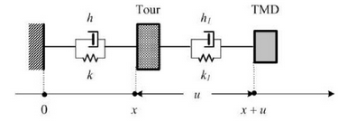

# TIPE
## A simulation of a TMD (Tuned Mass Damper) system using C and SDL2.


## Warning

- You might encounter memory leaks when closing the program. It depends, as it seems, whether you use a Nvidia graphics card with SDL2. I'm not entirely sure what is causing them behind the scenes, but I can't seem to fix it. There are **zero** (at least I hope) memory leaks that are caused by myself in this program. Here is a [link](https://forums.developer.nvidia.com/t/asan-reports-memory-leak-in-libnvidia-glcore-so-515-57/222697/2) that could explain you the situation. It sucks, but I can't really do anything about it on my own.
<br />

*P.S : you might not see those memory leaks warnings,because I run `clear` command right after the program ends.*

<br />
<br />


## What does it do ?
- It runs a simulation of a Tuned Mass Damper system, which are used to reduce seismic wave amplitude, following a basic theory model : ground being linked to the building by a spring (which will help create the oscillations), and the building being linked to the TMD. There are several parameters you can change : mass of each point of the building, mass of the actual TMD, stiffness of springs (which represent how rigid is the link between, let's say points of the building, or the building and TMD), the height and width (even though width doesn't really matter here) of the building.I'm currently working on a way to implement a floor system : each floor has 4 points, all linked together by springs.

<br /> 

<p align="center">
  
</p>
<br /> 

## Requirements 
- SDL2 is the graphic library that I use for this project (I don't really know OpenGL, and don't have time enough right now to dive into it.) 
You can download it on [SDL](https://www.libsdl.org/) (make sure you linked the .dll file correctly, of course) if you're on Windows, or just do 
```ps 
sudo apt get libsdl2-dev
```
if you're on Linux.

On MacOS, I have no clue if it works since I couldn't test it.

- GCC, or any C compiler should do the job. I've tested with GCC and Clang, and it seems to work fine for me. Don't be afraid to open an issue if it doesn't.

<br />

## How to install it on your computer ?

- Just clone it wherever you want in your computer.

```ps
git clone https://github.com/Esteban795/TIPE.git
```

- After that, head to the directory you cloned it in, and type 
```ps
make all
``` 

It should render this : 


- You can then press left or right arrow to force impulse on the building, and see how it reacts.

## What's left to do ?

- Improved floor system.
- Better way to change parameters. Maybe through a text file called config.py ? Maybe through makefile parameters ?